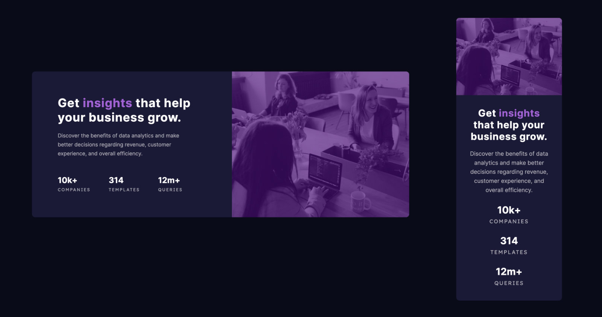

# Frontend Mentor - Stats preview card component solution

This is a solution to the [Stats preview card component challenge on Frontend Mentor](https://www.frontendmentor.io/challenges/stats-preview-card-component-8JqbgoU62). 

## Table of contents

- [Frontend Mentor - Stats preview card component solution](#frontend-mentor---stats-preview-card-component-solution)
  - [Table of contents](#table-of-contents)
  - [Overview](#overview)
    - [The challenge](#the-challenge)
    - [Screenshots](#screenshots)
    - [Links](#links)
  - [My process](#my-process)
    - [Built with](#built-with)
    - [What I learned](#what-i-learned)
    - [Continued development](#continued-development)
  - [Author](#author)

**Note: Delete this note and update the table of contents based on what sections you keep.**

## Overview

### The challenge

Users should be able to:

- View the optimal layout depending on their device's screen size

### Screenshots

Desktop & Mobile



### Links

- [Solution code on Github](https://github.com/mindful108/frontendmentor-stats-preview-card-component)
- [Live Site](https://frontendmentor-stats-preview-card-component-liart.vercel.app/)

## My process

### Built with

- Semantic HTML5 markup
- CSS with custom properties (variables)
- Flexbox
- Mobile-first workflow

### What I learned

A simple challenge overall but placing the images and adding color proved to be a little tricky.

Even though the image crops were nearly identical (with the mobile version actually being larger in both dimensions and file size than the desktop) I still used a responsive image solution just for practice, although using either image by itself would have been fine, and even recommended.

Here is the code I used for the images.

```html
      <picture>
        <source
          media="(max-width: 914px)"
          srcset="images/image-header-mobile.jpg"
        />
        <source
          media="(min-width: 915px)"
          srcset="images/image-header-desktop.jpg"
        />
        
      </picture>
```

I also added additional media queries for smaller screens at 400px and 322px

The image for mobile was simple, but the version for desktop took a little more care as I am not using background images here since I am using the HTML responsive image loading above. The only significant code was to set the image to have a height and then to change the object fit to cover.
```css
  .card-image {
    height: 100%;
    object-fit: cover;
  } 
```


### Continued development

I plan to do more Frontend Mentor projects to continue developing my speed and workflow using my own custom snippets and starter templates. I will also start to use Tailwind CSS and looking forward to incorporating React for more interactive challenges.

 
## Author

- Website - [Judah Lynn](https://judahlynn.com)
- Frontend Mentor - [@mindful108](https://www.frontendmentor.io/profile/mindful108)
